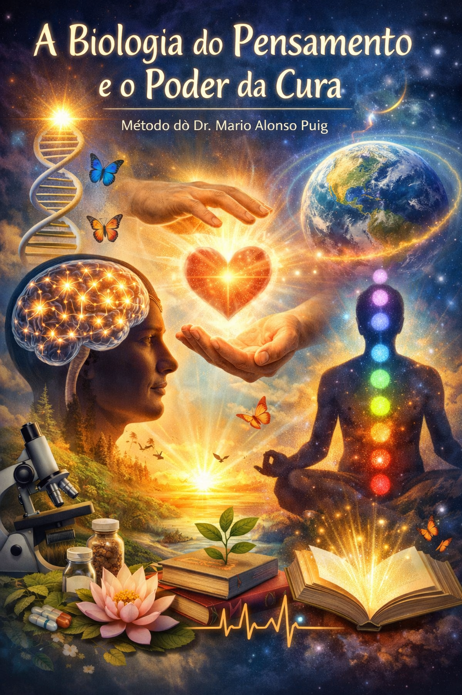

# 🧠 A Biologia do Pensamento e o Poder da Cura

## 📌 Contexto e Objetivos

Este projeto foi desenvolvido como parte de um desafio prático da DIO com o objetivo de explorar o uso da Inteligência Artificial como ferramenta de aprendizagem ativa.

O tema escolhido foi **“A Biologia do Pensamento e o Poder da Cura”**, inspirado nos conceitos do Dr. Mario Alonso Puig, que relacionam mente, emoções e impacto no corpo.

### 🎯 Objetivos de Estudo

- Compreender como os pensamentos influenciam o corpo biologicamente
- Explorar a relação entre emoções, cérebro e saúde
- Identificar práticas que favorecem o equilíbrio mental e físico
- Utilizar IA (NotebookLM) como ferramenta de organização e aprofundamento do conhecimento

---

## 📚 Curadoria de Fontes

As seguintes fontes foram utilizadas e inseridas no NotebookLM:

1. Livro: *Reinventar-se: Sua segunda oportunidade* – Mario Alonso Puig  
2. Artigos sobre neuroplasticidade (ex: Harvard Health Publishing)  
3. Conteúdos sobre inteligência emocional (Daniel Goleman)  
4. Estudos introdutórios sobre psiconeuroimunologia  
5. Conteúdos sobre mindfulness e meditação

*(Adicione aqui links reais, se quiser deixar mais forte ainda 👀)*

---

## 🧪 Engenharia de Prompts e "Cicatrizes"

### 🔹 Prompt 1:
**"Como os pensamentos influenciam o corpo biologicamente?"**

📌 Resultado:
- Explicação sobre hormônios como cortisol e dopamina
- Relação com estresse e sistema imunológico

⚠️ Dificuldade:
- Respostas muito genéricas no início

🔧 Ajuste:
**"Explique de forma científica e prática como pensamentos afetam o corpo, com exemplos reais."**

---

### 🔹 Prompt 2:
**"Explique a neuroplasticidade de forma simples"**

📌 Resultado:
- Conceito claro, mas pouco aplicável

🔧 Ajuste:
**"Explique a neuroplasticidade com exemplos do dia a dia e como aplicá-la para mudar hábitos"**

---

### 🔹 Prompt 3:
**"Como usar a mente para melhorar a saúde?"**

📌 Resultado:
- Resposta muito ampla

🔧 Ajuste:
**"Liste práticas baseadas em ciência que conectam mente e saúde (meditação, foco, respiração, etc.)"**

---

### 💡 Aprendizado (Cicatrizes)

- Prompts genéricos = respostas superficiais  
- Quanto mais específico → melhor qualidade  
- Pedir exemplos práticos melhora muito o resultado  
- IA precisa de direcionamento claro (contexto + objetivo)

---

## 📖 Miniguia de Estudo

### 🧠 Resumo Estruturado

A biologia do pensamento mostra que:

- Pensamentos geram reações químicas no cérebro  
- Emoções influenciam diretamente o corpo  
- O estresse libera cortisol (impacta negativamente a saúde)  
- Pensamentos positivos podem estimular bem-estar e equilíbrio  

A **neuroplasticidade** permite que o cérebro mude ao longo da vida, possibilitando a criação de novos padrões mentais.

---

### 📘 Glossário

- **Neuroplasticidade**: capacidade do cérebro de se reorganizar  
- **Cortisol**: hormônio do estresse  
- **Dopamina**: neurotransmissor do prazer e motivação  
- **Psiconeuroimunologia**: estudo da relação entre mente e sistema imunológico  
- **Mindfulness**: atenção plena ao momento presente  

---

### 🔁 Prompts Reutilizáveis

- "Explique [conceito] de forma simples e com exemplos práticos"
- "Resuma este conteúdo em tópicos claros"
- "Como aplicar esse conceito na vida real?"
- "Quais são os benefícios e riscos desse tema?"
- "Crie um checklist prático baseado nesse conteúdo"

---

## 🚀 Conclusão

Este projeto demonstrou como a Inteligência Artificial pode ser utilizada como uma ferramenta poderosa de aprendizado ativo, organização de conhecimento e desenvolvimento do pensamento crítico.

Além disso, reforça a importância da relação entre mente e corpo e como nossos pensamentos impactam diretamente nossa saúde e bem-estar.

---

## 🔗 Entrega

Repositório criado como parte do desafio da DIO.
